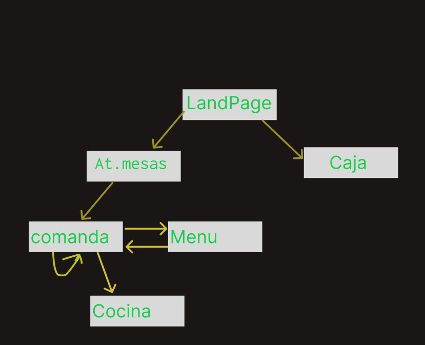

# AppRestautantes1.0
Aplicación para restaurantes y Cafetería. Versión de desarrollo 1.0
# Descripción

# User Stories

# FrontEnd
frameworks  , tools, hooks and modules a usar 
(vue)
Respecto de la presentación, el frontend presentara una estructura de pages como sigue.
No es necesario la presentación de fotos con productos para la carga de poductos en la comanda.S selecciona u producto de la lista y se selecciona cantidad y listo.
Los productos con fotos pueden tenerse en una pagina aparte y los clientes tienen una hoja con fotos.

## Landing
## Mozos
## Cocina
## Caja
## Admin

# Backend
Modulos, frameworks, ttools a usar.
Node- websockets- 

Tendrá las siguientes rutas paara la gestion y presentacion de cada operación:
## GET

## POST

## PUT  

## DELETE

# dataBase
La base de datos será NoSql, administrado con MongoDb, donde cada comanda sera un documento en BSON y tendrá la esructura siguiente:

# Users
Existirán tres categorias de usuarios.
- Mozo:
- Cocinero:
- Admin:
